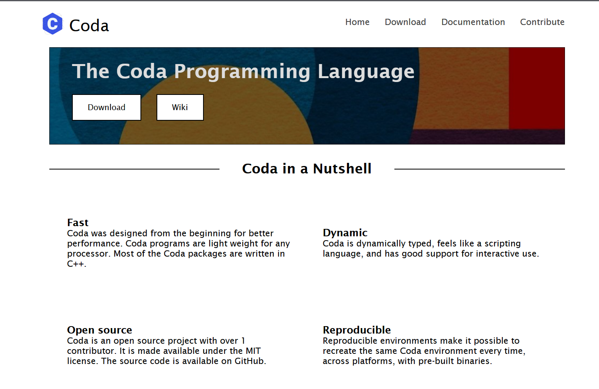
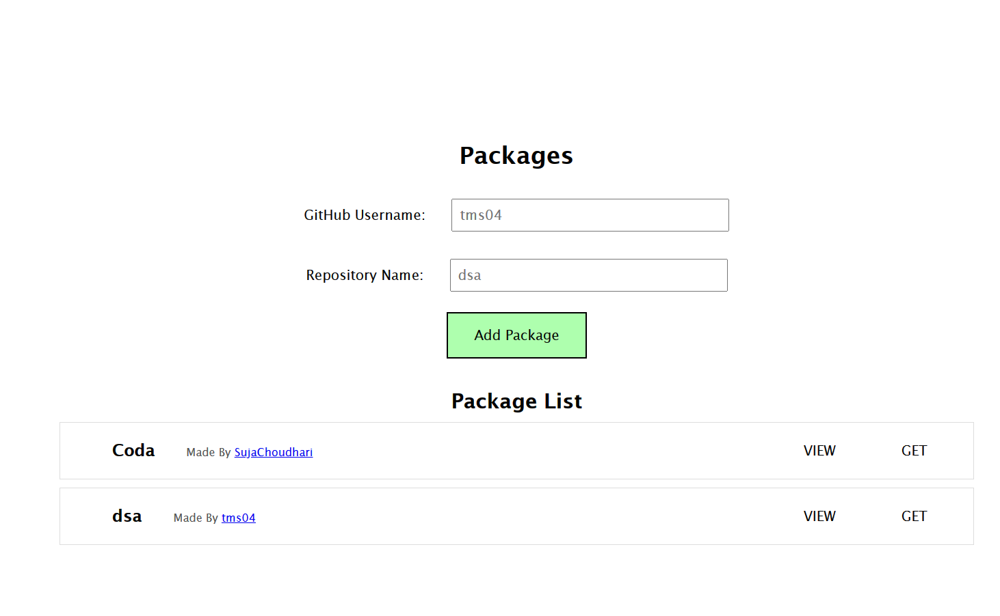
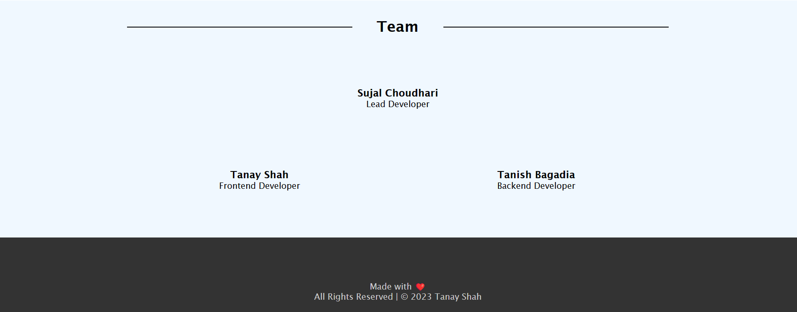

# PackageManager

A comprehensive package management system with a user-friendly frontend and a robust backend for efficient package tracking.

## Frontend

The frontend of the PackageManager project is developed using React.js. Below are the details on setting up and understanding the structure of the frontend.

### Hero Section
Hero section using Components


### Packages Section
Using MongoDB to Add and Get packages from DB


### Foooter Section
Basic Footer Components with Author Names

### Setup

1. **Clone the Repository:**
   ```bash
   git clone [repository-url]
   cd [repository-directory]
   ```


2. **Navigate to the Frontend Directory:**
   ```bash
   cd coda-website
   ```

3. **Install Dependencies:**
   ```bash
   npm install
   ```

4. **Run the Frontend:**
   ```bash
   npm start
   ```

   The frontend development server will start, and you can view the application on `http://localhost:3000`.

### Project Structure

The frontend follows a modular structure for better organization. The main entry point is the `Main.js` file, which orchestrates the different components to create the user interface.


#### Components

- **Navbar:**
  The navigation bar component for easy navigation throughout the application.

- **Nutshell:**
  A concise overview section providing key information about the project.

- **Hero:**
  The main hero section, possibly containing a call-to-action or project highlights.

- **Features:**
  Displaying the features or functionalities of the PackageManager.

- **Packages:**
  Rendering packages or package-related information.

- **Team:**
  Introducing the team behind the PackageManager project.

- **Footer:**
  The footer section, often containing contact information or links to related resources.

#### Styling

The styling for the frontend is managed using the `Main.css` file, which is imported into the `Main.js` file.

### Customization

Feel free to customize the components, styles, and content to match your project requirements. The React.js framework allows for easy modification and expansion of the frontend.

## Backend

The backend of this project is responsible for connecting to the MongoDB database, handling data retrieval, and providing endpoints for adding and fetching packages.

### Setup


1. **Navigate to the Backend Directory:**
   ```bash
   cd backend
   ```

2. **Install Dependencies:**
   ```bash
   npm install
   ```

3. **Create .env File:**
   Create a `.env` file in the `backend` directory and add the following:
   ```env
   MONGO_URI=your-mongodb-connection-string
   PORT=3001
   ```

   Replace `your-mongodb-connection-string` with your MongoDB connection string.

4. **Run the Backend:**
   ```bash
   npm start
   ```

   The server will start running on `http://localhost:3001`.

### How it Works

The backend is built using Node.js, Express, and Mongoose for MongoDB interaction. Here's a brief overview of the important components:

- **MongoDB Connection:**
  The backend connects to MongoDB using the provided connection string in the `.env` file.

- **Schema:**
  There is a MongoDB schema defined for packages, containing `username` and `repoName` fields.

- **Endpoints:**
  - `GET /`: Returns a message indicating that all systems are functional.
  - `POST /addPackage`: Adds a new package to the database. Send a JSON object in the request body with `username` and `repoName`.
  - `GET /getPackages`: Retrieves the first 50 packages from the database.

Feel free to explore and modify the backend code as needed. If you encounter any issues, refer to the error messages in the console or check the MongoDB connection.


## Authors

Meet the talented individuals behind the development of PackageManager:

- **Sujal Choudhari**
  - *Role:* Lead Developer

- **Tanay Shah**
  - *Role:* Frontend Developer

- **Tanish Bagadia**
  - *Role:* Backend Developer

---

This completes the README.md for the PackageManager project, providing comprehensive information on both the frontend and backend aspects. Happy coding!
